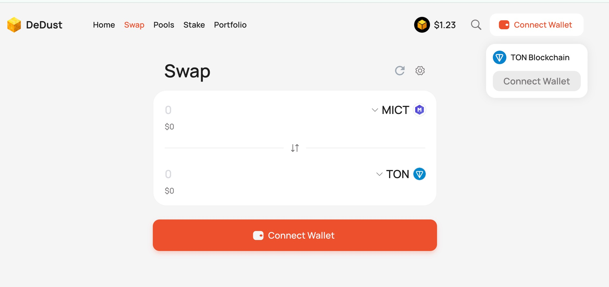
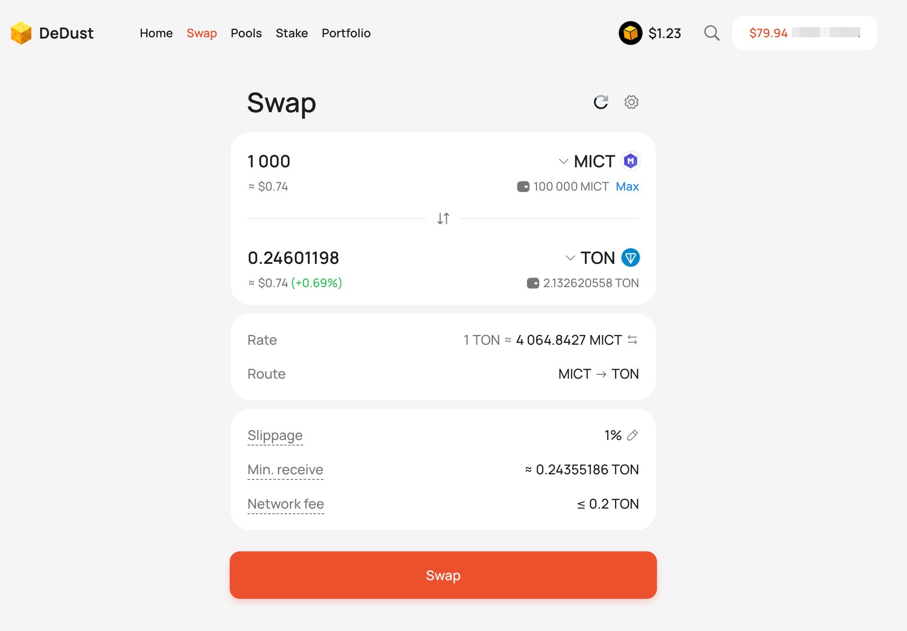

您可以通过去中心化交易所，交易MICT代币

## Dedust.io

访问地址：https://dedust.io/swap/TON/EQDTtusdnxjU7O5qyZyPMNBhxb96cZ69_5x17KaovygF2KLr

### 连接钱包

点击`Connect`按钮，使用你的`Tonkeeper`钱包或者`MyTonWallet`浏览器钱包，连接网站。

## 转划完成交易

<CardGroup>

<Card title="DeDust 去中心化交易所" icon="file" href="/web3/swap-mict-on-dedust">
  访问DeDust直接连接你的TONCoin钱包进行MICT交易。
</Card>

</CardGroup>

## 使用币安Web3钱包交易

您也可使用大交易所的使用Web3钱包进行MICT交易。

<CardGroup>

<Card title="欧易 DEX交易所" icon="file" href="/essentials/markdown">
  在OKX DEX交易所，连接你的Web3钱包即可交易。优选，手续费较低。
</Card>

<Card
  title="Bybit DEX交易所"
  icon="square-code"
  href="/essentials/code"
>
  在Bybit DEX交易所，连接你的Web3钱包即可交易。
</Card>

<Card
  title="币安 Web3钱包"
  icon="image"
  href="/essentials/images"
>
  使用币安Web3钱包交易MICT代币。[binancewallet](https://www.binance.com/zh-CN/binancewallet)
</Card>

<Card
  title="Dedust.io TON交易对"
  icon="image"
  href="https://dedust.io/swap/EQDTtusdnxjU7O5qyZyPMNBhxb96cZ69_5x17KaovygF2KLr/TON"
>
  去中心化交易所Dedust.io可以交易MICT/TON交易对。
</Card>

<Card
  title="Dedust.io USDT交易对"
  icon="image"
  href="https://dedust.io/swap/EQDTtusdnxjU7O5qyZyPMNBhxb96cZ69_5x17KaovygF2KLr/USDT"
>
  去中心化交易所Dedust.io可以交易MICT/USDT交易对。
</Card>

</CardGroup>
