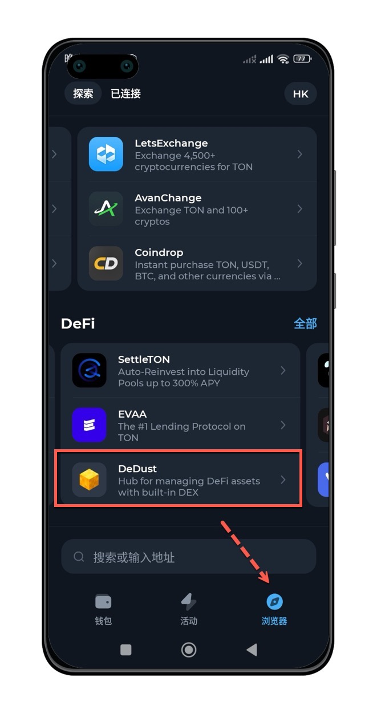
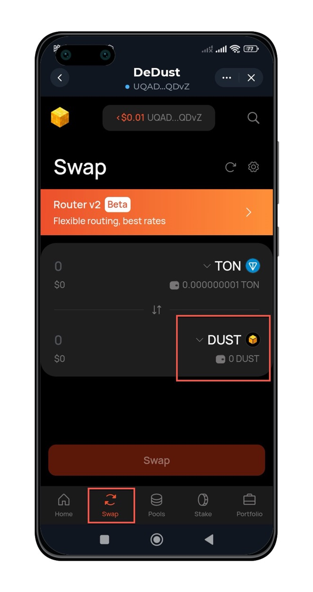
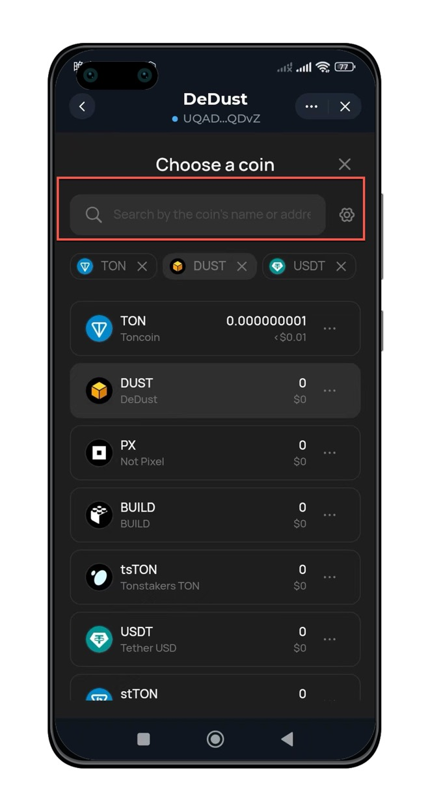
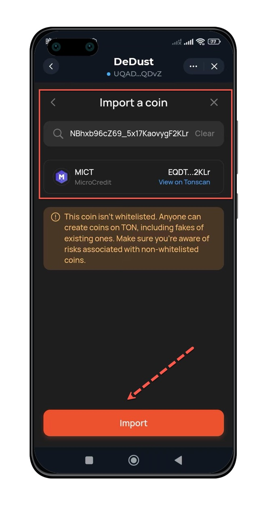
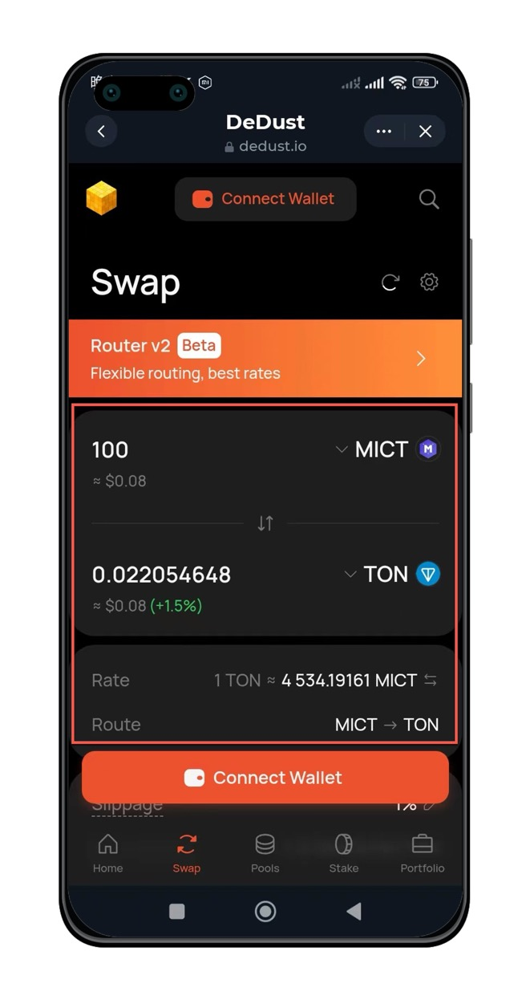
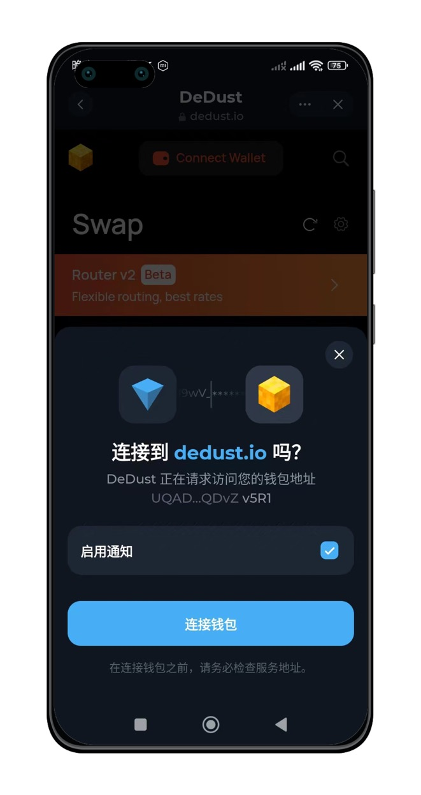

## 下载并安装TonKeeper钱包App

Tonkeeper 是您非常个人化的钱包，[TonKeeper官方网站：https://tonkeeper.com/](https://tonkeeper.com/)。

### 下载钱包APP

<AccordionGroup>
  <Accordion icon="github" title="TonKeeper钱包下载">
    [TonKeeper安卓版本（谷歌Playstore下载）](https://play.google.com/store/apps/details?id=com.ton_keeper)

    [TonKeeper安卓版本（官方APK），地址可能会随版本变动](https://github.com/tonkeeper/android/releases/download/v5.0.21/Tonkeeper_965.apk)

    [TonKeeper苹果手机](https://apps.apple.com/us/app/tonkeeper-ton-wallet/id1587742107) 

  </Accordion>
</AccordionGroup>

## 创建个人钱包

该步骤，可以参考 [TonKeeper使用指南](../wallet-app/tonkeeper-guide)

## 去中心化交易所

### 进入去中心化交易所

点击底部【Browse/浏览器】标签按钮，进入DeFi模块，选择【DeDust】去中心化交易所。

### 通过SWAP进行交易

点击【SWAP】按钮，并更改交易项为【MICT】

在弹出的Token选项中，搜索【MICT】，

如果没有搜索到，可以在搜索框中输入MICT代币合约地址。

代币合约地址：`EQDTtusdnxjU7O5qyZyPMNBhxb96cZ69_5x17KaovygF2KLr`。

点击【import】按钮后，设置兑换方式。

根据需要，可以选择【买】或者【卖】，MICT在上方是卖，MICT在下方是买。

### 绑定钱包进行交易

点击【Connect Wallet】绑定钱包进行交易

