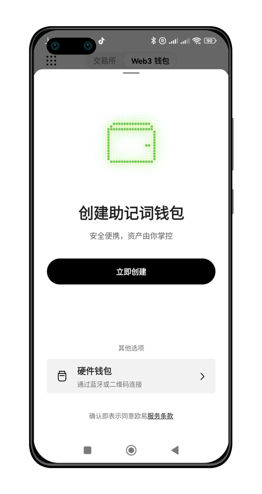
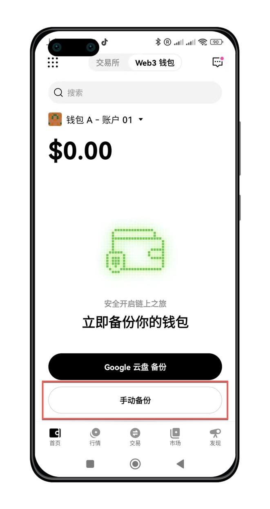
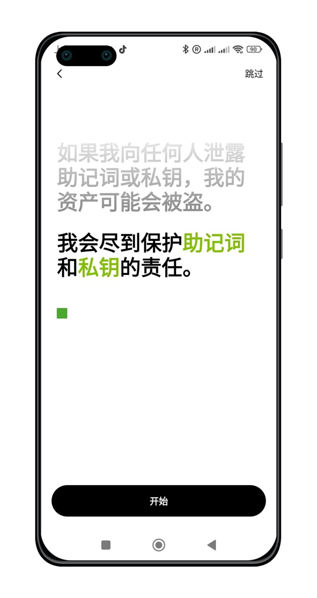
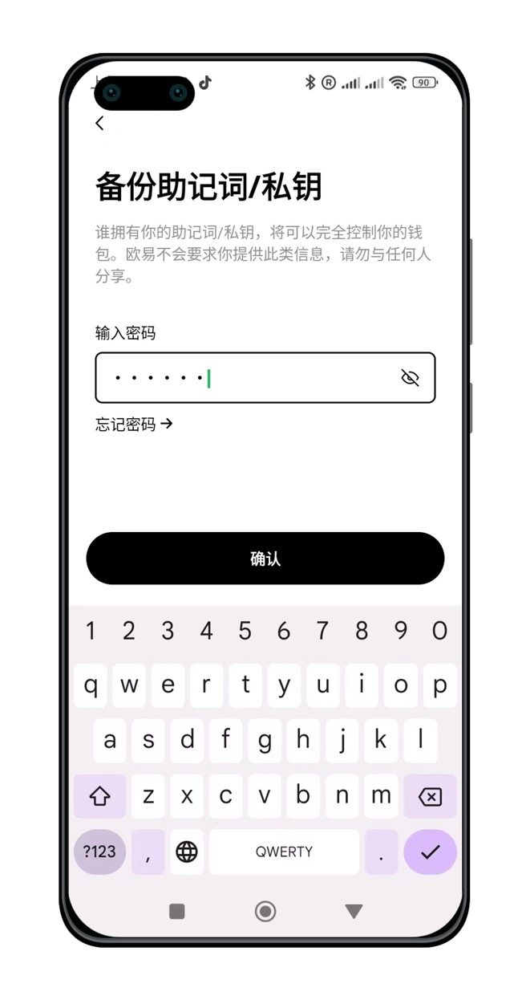
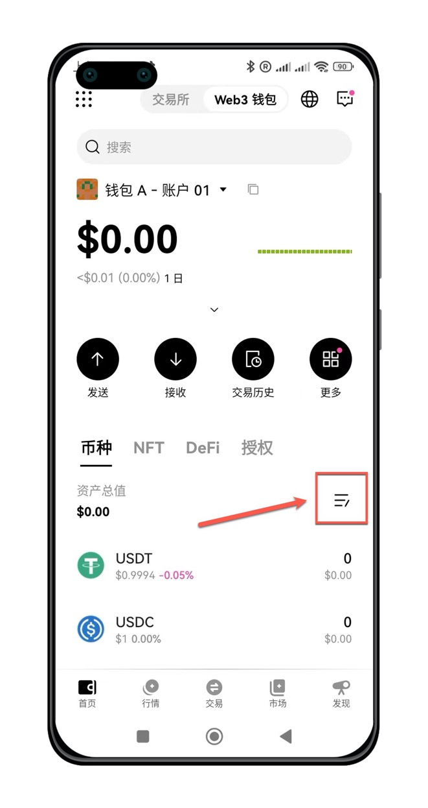

## 下载并安装欧易Web3钱包

欧易Web3钱包提供安卓和iOS两个版本。[OKX APP官方下载地址](https://www.okx.com/zh-hans/download)，推荐去官方网站下载。

### 下载钱包APP

<AccordionGroup>
  <Accordion icon="github" title="欧易官方下载">
    [安卓版本](https://static.damvx.com/upgradeapp/okx-android.apk)

    [苹果手机](https://apps.apple.com/us/app/okx-buy-bitcoin-eth-crypto/id1327268470) 

  </Accordion>
  <Accordion icon="rectangle-terminal" title="镜像网站加速下载">

    [安卓加速版](https://static.damvx.com/upgradeapp/okx-android.apk)

    <Note>
     镜像网站可能因为防火墙问题，临时访问不了，此时需要自备梯子。
    </Note>
  </Accordion>
</AccordionGroup>

### 启动钱包APP

下载完成后，点击手机界面APP Logo，启动APP

## 创建资产钱包

进入顶部`Web3`，进入Web3钱包。首次使用，选择`创建钱包`。

点击`立即创建`按钮

根据提示，设置钱包的密码，完成后点击`继续`。

钱包创建完成，根据提示，开始备份钱包，默认选择`手动备份`。

认真看完文字提示，点击`继续`按钮。

认真看完文字提示，点击`开始`按钮。

根据提示，输入一次钱包密码，点击`确认`按钮。

再次阅读屏幕风险提示，点击`我知道了`按钮。

抄写，备份提示词。为了您的财产安全，请勿截图，拍照，存手机。强力建议用纸币记录下来，并收藏保管好。

点击`继续`按钮，进入钱包首页。

