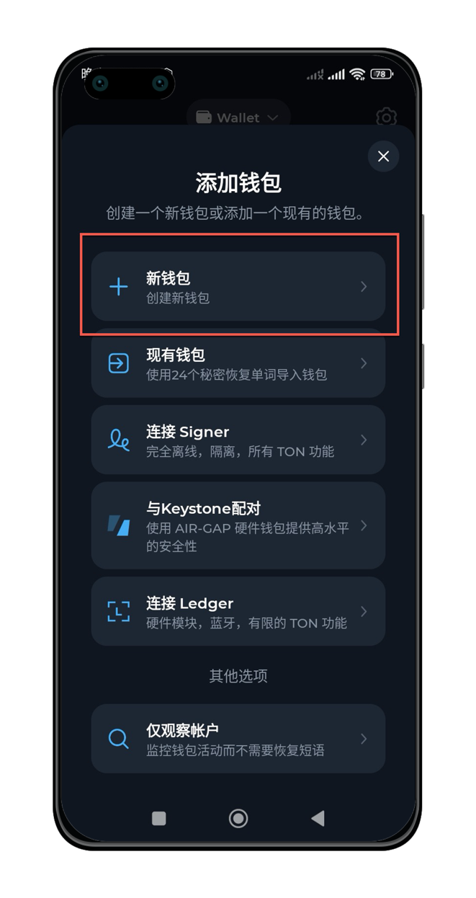
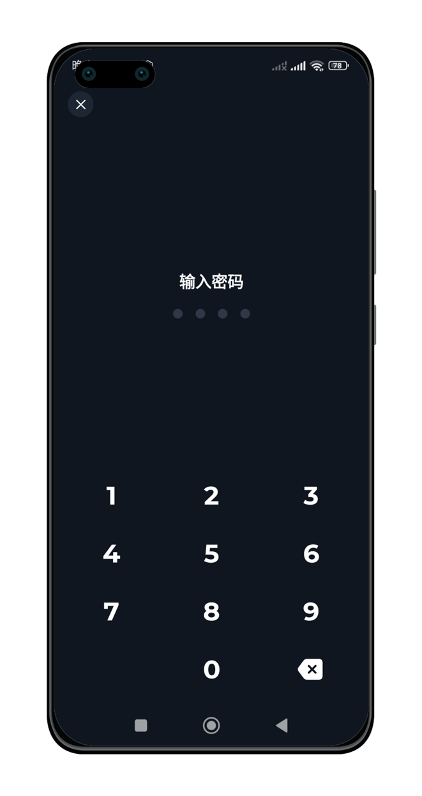
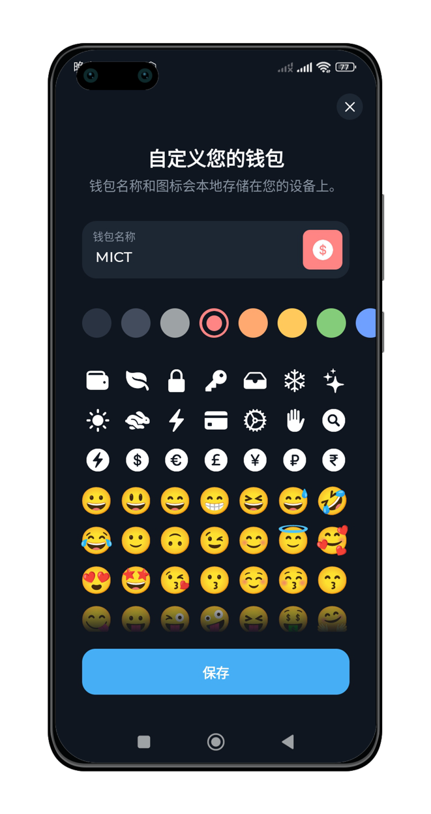
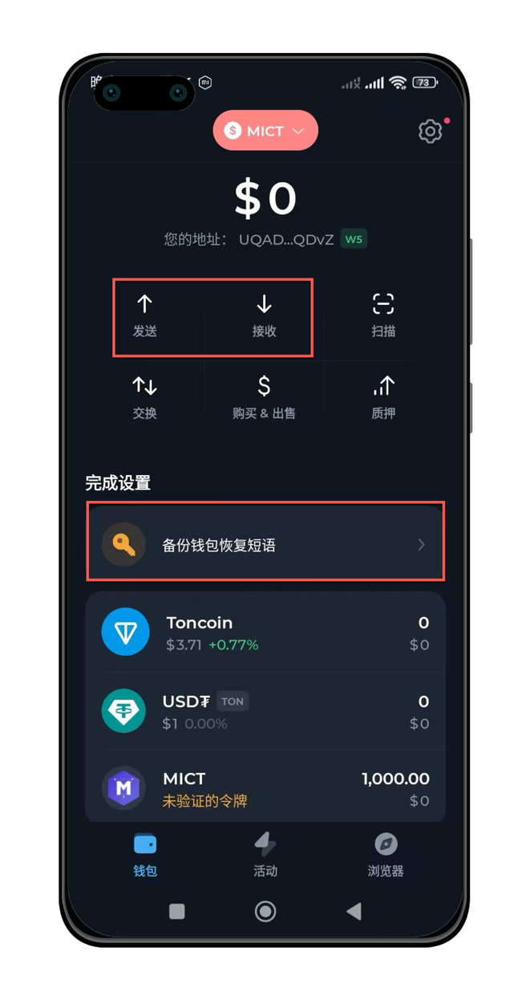
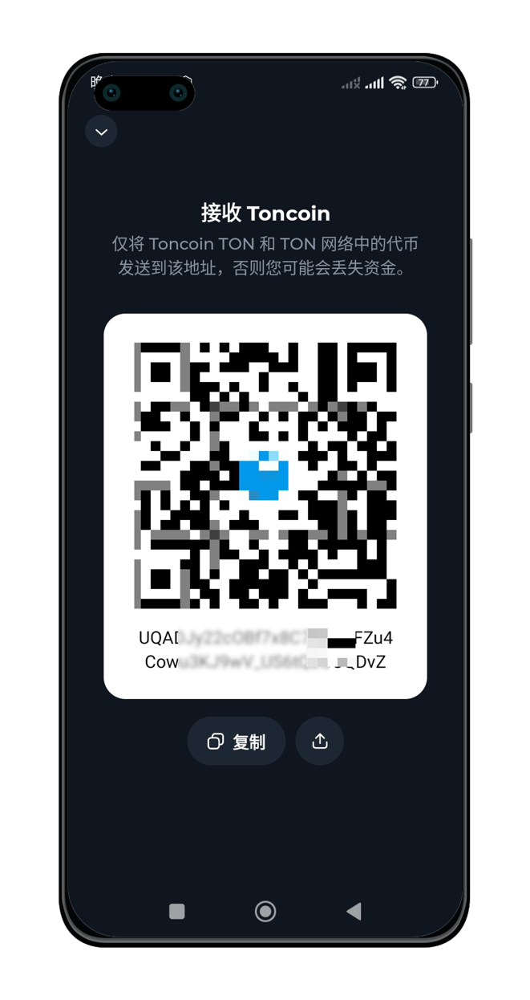
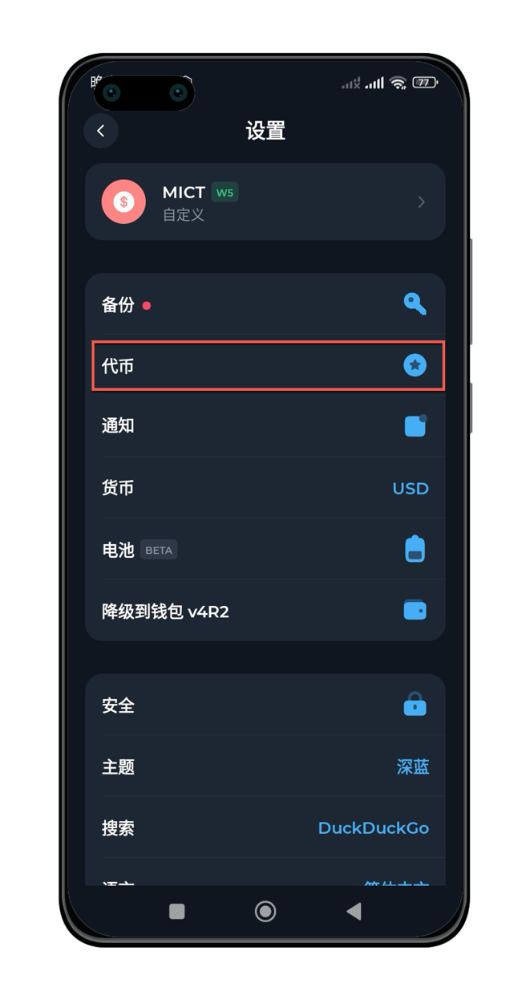
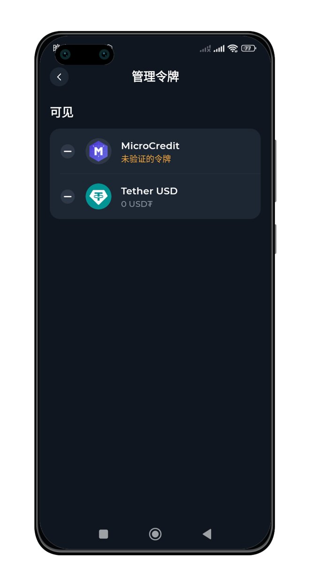
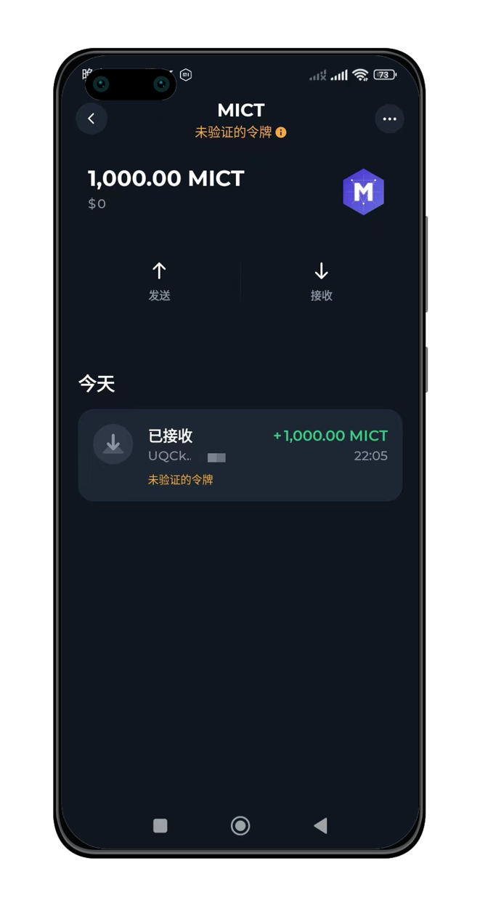

如何使用TonKeeper钱包

## 下载TonKeeper钱包APP

<AccordionGroup>
  <Accordion icon="github" title="TonKeeper钱包下载">
    [TonKeeper安卓版本（谷歌Playstore下载）](https://play.google.com/store/apps/details?id=com.ton_keeper)

    [TonKeeper安卓版本（官方APK），地址可能会随版本变动](https://github.com/tonkeeper/android/releases/download/v5.0.21/Tonkeeper_965.apk)

    [TonKeeper苹果手机](https://apps.apple.com/us/app/tonkeeper-ton-wallet/id1587742107) 

  </Accordion>
</AccordionGroup>

下载完成后，点击App Logo启动钱包程序

## 创建钱包

根据APP运行提示，创建一个钱包。

### 选择【新建钱包】

### 设置密码

### 设置钱包名称

### 备份钱包短语并使用钱包收发TON及代币

### 点击【接收】按钮后，可获得钱包地址，并可复制。

### 如果没有看到MICT代币，可通过设置添加

如果他人给你发送了MICT代币，但是钱包页面没有正常展示，可以通过设置添加。

点击【设置】按钮，选择【代币】进行查看或者设置。

### 在【代币】页面，选择隐藏或者展示代币

### 当代币能够正常展示后，可以查看期余额及交易记录

