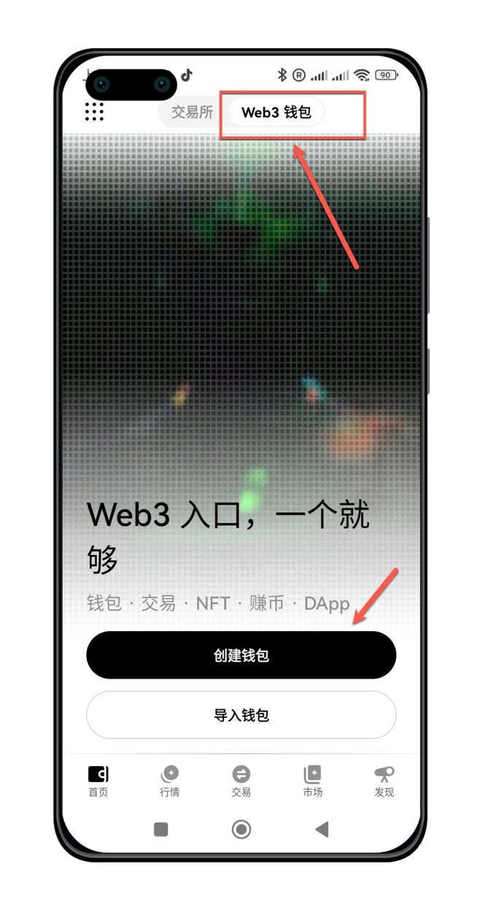

## 下载并安装Web3钱包

介绍如何下载Web3钱包 APP

### 客户端下载

<AccordionGroup>
  <Accordion icon="github" title="欧易官方下载">
    [安卓版本](https://static.damvx.com/upgradeapp/okx-android.apk)

    [苹果手机](https://apps.apple.com/us/app/okx-buy-bitcoin-eth-crypto/id1327268470) 

  </Accordion>
  <Accordion icon="rectangle-terminal" title="镜像网站加速下载">

    [安卓加速版](https://static.damvx.com/upgradeapp/okx-android.apk)


    <Note>
     镜像网站可能因为防火墙问题，临时访问不了，此时需要自备梯子。
    </Note>
  </Accordion>
</AccordionGroup>


### 启动钱包APP

下载完成后，点击手机界面APP Logo，启动APP



进入顶部`Web3`，进入Web3钱包。首次使用，选择`创建钱包`。


## 启动APP创建钱包

## 添加MICT代币Token

## 接受$MICT并交易

## Setup your development

Learn how to update your docs locally and deploy them to the public.

### Edit and preview

<AccordionGroup>
  <Accordion icon="github" title="Clone your docs locally">
    During the onboarding process, we created a repository on your Github with
    your docs content. You can find this repository on our
    [dashboard](https://dashboard.mintlify.com). To clone the repository
    locally, follow these
    [instructions](https://docs.github.com/en/repositories/creating-and-managing-repositories/cloning-a-repository)
    in your terminal.
  </Accordion>
  <Accordion icon="rectangle-terminal" title="Preview changes">
    Previewing helps you make sure your changes look as intended. We built a
    command line interface to render these changes locally. 
    1. Install the
    [Mintlify CLI](https://www.npmjs.com/package/mintlify) to preview the
    documentation changes locally with this command: ``` npm i -g mintlify ```
    2. Run the following command at the root of your documentation (where
    `docs.json` is): ``` mintlify dev ```
    <Note>
      If you’re currently using the legacy ```mint.json``` configuration file, please update the Mintlify CLI:


      ```npm i -g mintlify@latest```
      And run the new upgrade command in your docs repository:

      ```mintlify upgrade```
      You should now be using the new ```docs.json``` configuration file. Feel free to delete the ```mint.json``` file from your repository.
    </Note>
  </Accordion>
</AccordionGroup>

### Deploy your changes

<AccordionGroup>

<Accordion icon="message-bot" title="Install our Github app">
  Our Github app automatically deploys your changes to your docs site, so you
  don't need to manage deployments yourself. You can find the link to install on
  your [dashboard](https://dashboard.mintlify.com). Once the bot has been
  successfully installed, there should be a check mark next to the commit hash
  of the repo.
</Accordion>
<Accordion icon="rocket" title="Push your changes">
  [Commit and push your changes to
  Git](https://docs.github.com/en/get-started/using-git/pushing-commits-to-a-remote-repository#about-git-push)
  for your changes to update in your docs site. If you push and don't see that
  the Github app successfully deployed your changes, you can also manually
  update your docs through our [dashboard](https://dashboard.mintlify.com).
</Accordion>

</AccordionGroup>

## Update your docs

Add content directly in your files with MDX syntax and React components. You can use any of our components, or even build your own.

<CardGroup>

<Card title="Add Content With MDX" icon="file" href="/essentials/markdown">
  Add content to your docs with MDX syntax.
</Card>

<Card
  title="Add Code Blocks"
  icon="square-code"
  href="/essentials/code"
>
  Add code directly to your docs with syntax highlighting.
</Card>

<Card
  title="Add Images"
  icon="image"
  href="/essentials/images"
>
  Add images to your docs to make them more engaging.
</Card>

<Card
  title="Add Custom Components"
  icon="puzzle-piece"
  href="/essentials/reusable-snippets"
>
  Add templates to your docs to make them more reusable.
</Card>

</CardGroup>
