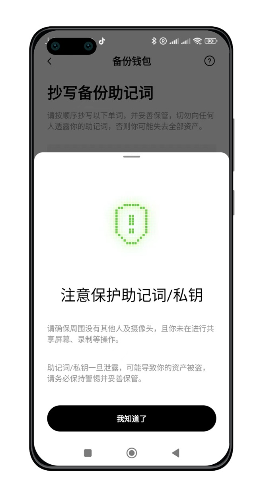
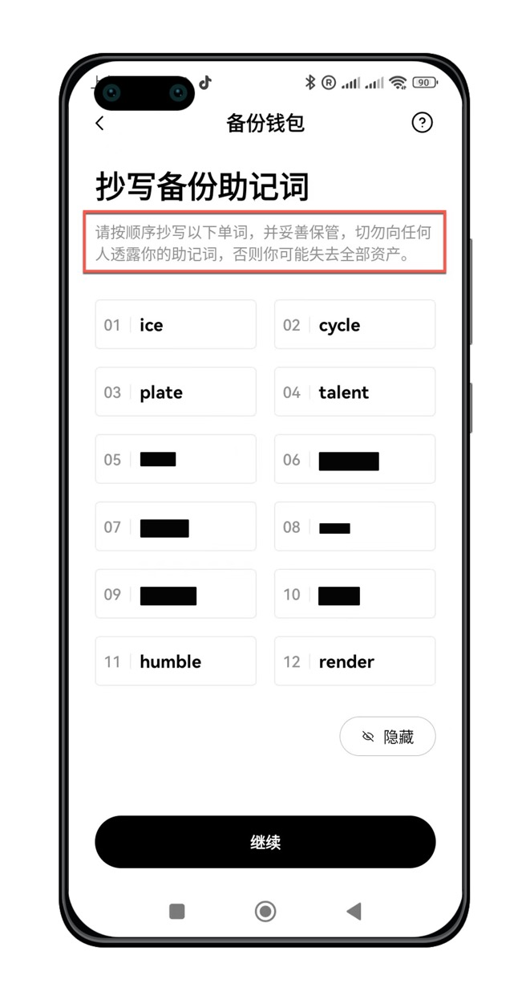
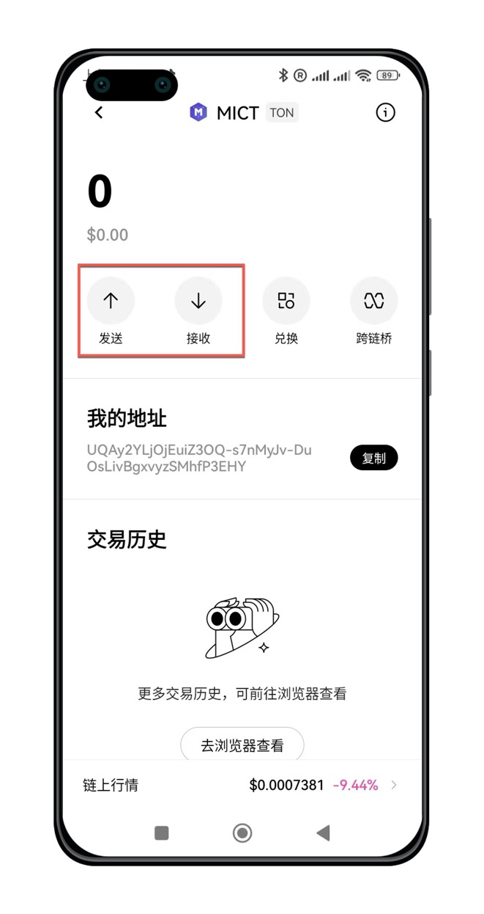
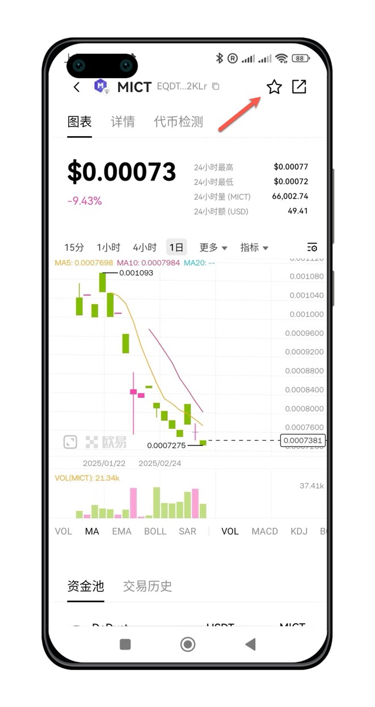

## 下载并安装欧易Web3钱包

介绍如何下载Web3钱包 APP

### 下载钱包APP

<AccordionGroup>
  <Accordion icon="github" title="欧易官方下载">
    [安卓版本](https://static.damvx.com/upgradeapp/okx-android.apk)

    [苹果手机](https://apps.apple.com/us/app/okx-buy-bitcoin-eth-crypto/id1327268470) 

  </Accordion>
  <Accordion icon="rectangle-terminal" title="镜像网站加速下载">

    [安卓加速版](https://static.damvx.com/upgradeapp/okx-android.apk)


    <Note>
     镜像网站可能因为防火墙问题，临时访问不了，此时需要自备梯子。
    </Note>
  </Accordion>
</AccordionGroup>


### 启动钱包APP

下载完成后，点击手机界面APP Logo，启动APP


## 创建资产钱包

进入顶部`Web3`，进入Web3钱包。首次使用，选择`创建钱包`。

点击`立即创建`按钮


根据提示，设置钱包的密码，完成后点击`继续`。


钱包创建完成，根据提示，开始备份钱包，默认选择`手动备份`。


认真看完文字提示，点击`继续`按钮。


认真看完文字提示，点击`开始`按钮。


根据提示，输入一次钱包密码，点击`确认`按钮。


再次阅读屏幕风险提示，点击`我知道了`按钮。



抄写，备份提示词。为了您的财产安全，请勿截图，拍照，存手机。强力建议用纸币记录下来，并收藏保管好。



点击`继续`按钮，进入钱包首页。


## 添加$MICT代币Token

点击钱包币种右侧的功能按钮。


点击"自定义币种"。

选择网络：TON。 Jetton Master输入$MICT代币的合约地址：`EQDTtusdnxjU7O5qyZyPMNBhxb96cZ69_5x17KaovygF2KLr`。确认后代币名称和精准度会自动补全。


点击`确认`按钮后，就可以看到`$MICT`代币了。


点击返回按钮，回到钱包首页，可有看到MICT的名称和LOGO。

## 接收$MICT并交易


点击MICT代币名称，可进入MICT资产收发界面。



点击`接收`按钮，可以向他人展示自己的钱包地址以及地址二维码。以后，别人让你发钱包地址，就发这里的地址。


如果有人向你转账`$MICT`，在钱包余额中能看到。


点击链上行情，可以查看币价，并进行交易。推荐点击收藏按钮，方便后续使用。



由于MICT是在TON网络上发行的代币，因此买卖MICT之前，您的钱包需要拥有一定的TON作为交易手续费。


## Setup your development

Learn how to update your docs locally and deploy them to the public.

### Edit and preview

<AccordionGroup>
  <Accordion icon="github" title="Clone your docs locally">
    During the onboarding process, we created a repository on your Github with
    your docs content. You can find this repository on our
    [dashboard](https://dashboard.mintlify.com). To clone the repository
    locally, follow these
    [instructions](https://docs.github.com/en/repositories/creating-and-managing-repositories/cloning-a-repository)
    in your terminal.
  </Accordion>
  <Accordion icon="rectangle-terminal" title="Preview changes">
    Previewing helps you make sure your changes look as intended. We built a
    command line interface to render these changes locally. 
    1. Install the
    [Mintlify CLI](https://www.npmjs.com/package/mintlify) to preview the
    documentation changes locally with this command: ``` npm i -g mintlify ```
    2. Run the following command at the root of your documentation (where
    `docs.json` is): ``` mintlify dev ```
    <Note>
      If you’re currently using the legacy ```mint.json``` configuration file, please update the Mintlify CLI:


      ```npm i -g mintlify@latest```
      And run the new upgrade command in your docs repository:

      ```mintlify upgrade```
      You should now be using the new ```docs.json``` configuration file. Feel free to delete the ```mint.json``` file from your repository.
    </Note>
  </Accordion>
</AccordionGroup>

### Deploy your changes

<AccordionGroup>

<Accordion icon="message-bot" title="Install our Github app">
  Our Github app automatically deploys your changes to your docs site, so you
  don't need to manage deployments yourself. You can find the link to install on
  your [dashboard](https://dashboard.mintlify.com). Once the bot has been
  successfully installed, there should be a check mark next to the commit hash
  of the repo.
</Accordion>
<Accordion icon="rocket" title="Push your changes">
  [Commit and push your changes to
  Git](https://docs.github.com/en/get-started/using-git/pushing-commits-to-a-remote-repository#about-git-push)
  for your changes to update in your docs site. If you push and don't see that
  the Github app successfully deployed your changes, you can also manually
  update your docs through our [dashboard](https://dashboard.mintlify.com).
</Accordion>

</AccordionGroup>

## Update your docs

Add content directly in your files with MDX syntax and React components. You can use any of our components, or even build your own.

<CardGroup>

<Card title="Add Content With MDX" icon="file" href="/essentials/markdown">
  Add content to your docs with MDX syntax.
</Card>

<Card
  title="Add Code Blocks"
  icon="square-code"
  href="/essentials/code"
>
  Add code directly to your docs with syntax highlighting.
</Card>

<Card
  title="Add Images"
  icon="image"
  href="/essentials/images"
>
  Add images to your docs to make them more engaging.
</Card>

<Card
  title="Add Custom Components"
  icon="puzzle-piece"
  href="/essentials/reusable-snippets"
>
  Add templates to your docs to make them more reusable.
</Card>

</CardGroup>
